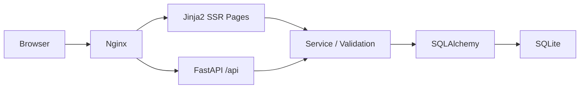

# Sine Web

FastAPI only 방식으로 만든 SSR 인증 데모입니다.

## 기술 스택

| 영역 | 선택 기술 | 선택 이유 |
| --- | --- | --- |
| 웹 프레임워크 | FastAPI | SSR 페이지 라우트와 API 라우트를 함께 관리하기 좋고, 의존성 주입과 문서화가 편함 |
| 템플릿 | Jinja2 | `base.html`, `include` 중심의 서버 렌더링 구조를 단순하게 만들 수 있음 |
| 상호작용 | HTMX | SPA 없이도 폼 검증과 부분 갱신을 붙일 수 있음 |
| ORM | SQLAlchemy 2.x | 모델, 세션, 쿼리 책임을 분리하기 좋음 |
| 데이터베이스 | SQLite | 데모 프로젝트에 맞게 설정이 가장 단순하고 로컬 실행이 쉬움 |
| 인증 | SessionMiddleware | JWT 없이 쿠키 세션 기반 로그인 상태를 빠르게 구성할 수 있음 |
| 비밀번호 해시 | pwdlib(argon2) | 평문 저장 없이 안전하게 비밀번호를 검증할 수 있음 |
| 실행 서버 | Uvicorn | FastAPI ASGI 앱을 가장 단순하게 실행할 수 있음 |
| 컨테이너 | Docker / Docker Compose | 실행 환경을 고정하고 로컬과 배포 환경 차이를 줄이기 좋음 |
| 프록시 | Nginx | HTTPS 종료, 리버스 프록시, 정적/접속 지점을 분리하기 좋음 |

## 전체 구조

### 프론트

- Jinja2 기반 서버 렌더링
- 페이지 라우트는 `/`, `/signup`, `/login`, `/profile`
- 공통 레이아웃은 `base.html`
- 일부 폼 상호작용은 HTMX로 부분 갱신

### 백엔드

- FastAPI가 페이지 라우트와 API 라우트를 함께 제공
- 페이지 라우트는 HTML 응답, API 라우트는 JSON 응답
- 서비스 계층에서 인증과 검증 로직 처리
- 세션 쿠키로 로그인 상태 유지

### DB

- SQLite 파일 DB 사용
- SQLAlchemy 모델 `User` 중심 구조
- 앱 시작 시 테이블 자동 생성

### 프록시

- Nginx가 외부 요청을 먼저 받음
- HTTPS 종료와 리버스 프록시 역할 담당
- FastAPI는 내부 애플리케이션 서버로 동작
