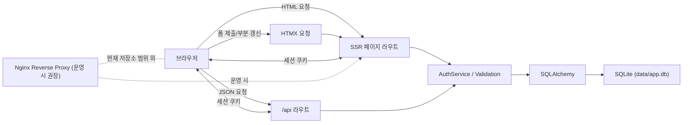

# Sine Web

FastAPI only 방식으로 만든 SSR 인증 데모입니다.  
회원가입, 로그인, 프로필 조회를 중심으로 구성했고, 일부 폼 상호작용에는 HTMX를 적용했습니다.

## 목표

- FastAPI로 HTML을 직접 렌더링하는 구조 구현
- 페이지 라우트와 API 라우트 분리
- PRG(Post -> Redirect -> Get) 패턴 적용
- 최소한의 JavaScript로 UX 개선

## 주요 기능

- 회원가입
- 로그인
- 로그아웃
- 로그인 후 프로필 조회
- 회원가입 아이디 중복 확인 HTMX 반영
- 로그인/회원가입 폼 오류의 HTMX 부분 갱신

## 기술 스택

| 영역 | 선택 기술 | 선택 이유 |
| --- | --- | --- |
| 백엔드 프레임워크 | FastAPI | 라우팅, 의존성 주입, Form 처리, API 문서화를 한 번에 가져가기 좋음 |
| 템플릿 | Jinja2 | SSR 구조에서 `base.html`, `include` 기반 재사용이 쉬움 |
| 부분 상호작용 | HTMX | SPA 없이 폼 일부만 갱신할 수 있어 FastAPI only 방향과 잘 맞음 |
| ORM/DB 접근 | SQLAlchemy 2.x | 모델 정의와 쿼리 분리가 명확하고 FastAPI와 조합이 안정적임 |
| DB | SQLite | 데모 프로젝트에서 설정 비용이 낮고 로컬 실행이 쉬움 |
| 인증 상태 유지 | Starlette `SessionMiddleware` | JWT 없이도 쿠키 세션 기반 로그인 상태를 간단히 유지 가능 |
| 비밀번호 해시 | `pwdlib[argon2]` | 평문 저장 없이 안전하게 해시 처리 가능 |
| 실행 환경 | Uvicorn | FastAPI ASGI 서버로 가장 단순한 실행 방식 |
| 패키지 관리 | `uv` | 의존성 설치와 실행 속도가 빠르고 관리가 단순함 |
| 컨테이너 실행 | Docker / Docker Compose | 로컬 환경 차이를 줄이고 배포 전 실행 단위를 고정하기 좋음 |

## 구현 과정

1. FastAPI 앱 골격을 만들고 정적 파일, 템플릿, 세션 미들웨어를 연결했습니다.
2. 사용자 모델과 인증 서비스를 분리해 회원가입/로그인 로직을 서비스 계층에 모았습니다.
3. SSR 페이지 라우트를 추가해 회원가입, 로그인, 프로필 흐름을 PRG 패턴으로 구성했습니다.
4. 로그아웃 흐름을 추가해 세션 종료까지 기본 인증 사이클을 완성했습니다.
5. `/api` JSON 라우트를 별도로 추가해 Swagger 문서에는 API만 노출되도록 분리했습니다.
6. HTMX를 붙여 회원가입 아이디 중복 확인과 폼 오류 갱신을 페이지 새로고침 없이 처리했습니다.
7. 프로필의 가입 시각은 한국 시간으로 변환해서 표시하고, favicon까지 마감했습니다.

## 전체 구조



### 프론트

- 서버 렌더링 기반 Jinja2 템플릿 사용
- 공통 레이아웃은 `base.html`
- 공통 UI는 `includes/header.html`, `includes/footer.html`
- 로그인/회원가입 폼은 HTMX partial로 분리
- 별도 SPA 프레임워크 없이 CSS + HTMX만 사용

### 백엔드

- `app/main.py`에서 FastAPI 앱, 세션 미들웨어, static mount, router 연결
- 페이지 라우트:
  - `/`
  - `/signup`
  - `/login`
  - `/profile`
- API 라우트:
  - `/api/signup`
  - `/api/login`
  - `/api/logout`
  - `/api/profile`
- 페이지 라우트는 `include_in_schema=False`로 문서에서 숨기고, API만 `/docs`에 노출
- 서비스 계층에서 회원가입/로그인/사용자 조회 처리

### DB

- SQLite 파일 DB 사용: `data/app.db`
- SQLAlchemy 모델:
  - `User`
    - `id`
    - `username`
    - `nickname`
    - `password_hash`
    - `created_at`
- 앱 시작 시 테이블 자동 생성

### 프록시

- 현재 저장소에는 Nginx 설정을 포함하지 않았습니다.
- 운영 환경 기준 권장 구조는 아래와 같습니다.

```text
Client
  -> Nginx (TLS 종료, 정적 캐시, reverse proxy)
  -> Uvicorn/FastAPI
  -> SQLite 또는 운영용 DB
```

- 현재 로컬 실행은 `uvicorn` 직접 실행 기준입니다.
- Docker 기준으로는 `compose.yaml`에서 FastAPI 앱 컨테이너를 먼저 띄우고, 이후 Nginx를 앞단에 붙이는 구조로 확장할 수 있습니다.
- HTTPS, 도메인, 리버스 프록시는 후속 배포 단계에서 붙이는 구조를 전제로 했습니다.

## 디렉터리 구조

```text
app/
  core/        공통 설정, DB, 템플릿, 시간 변환
  models/      SQLAlchemy 모델
  routers/     페이지 라우트와 API 라우트
  schemas/     API 요청/응답 스키마
  services/    인증/검증 로직
  static/      CSS, favicon
  templates/   Jinja2 템플릿
data/
  app.db       SQLite DB 파일
```

## 실행 방법

### 로컬 실행

```bash
uv sync
uv run uvicorn app.main:app --reload
```

- 페이지: `http://127.0.0.1:8000`
- API 문서: `http://127.0.0.1:8000/docs`

### Docker 실행

```bash
docker compose up --build
```

- 페이지: `http://127.0.0.1:8000`
- API 문서: `http://127.0.0.1:8000/docs`
- SQLite 데이터는 `./data` 디렉터리를 컨테이너의 `/app/data`에 마운트해서 유지합니다.

### Docker 파일 설명

- `Dockerfile`
  - `python:3.13-slim` 기반
  - 프로젝트 전체를 복사한 뒤 `pip install .`로 의존성 설치
  - `uvicorn app.main:app --host 0.0.0.0 --port 8000` 실행
- `compose.yaml`
  - `8000:8000` 포트 매핑
  - `SESSION_SECRET` 환경변수 주입
  - `./data:/app/data` 볼륨 마운트
- `.dockerignore`
  - `.venv`, `.git`, `.serena`, SQLite DB 파일 등 불필요한 파일 제외

## 인증 방식

- 현재는 JWT가 아니라 쿠키 세션 기반입니다.
- 로그인 성공 시 세션에 `user_id`를 저장합니다.
- 데모 기준 구현이며, 운영 환경에서는 아래 보강이 필요합니다.
  - 강한 `SESSION_SECRET`
  - HTTPS 강제
  - `https_only=True`
  - CSRF 대응
  - 필요 시 서버 저장형 세션 또는 별도 인증 체계

## 참고

- 이 프로젝트는 데모 목적이라 SQLite와 단일 프로세스 실행을 기준으로 합니다.
- 운영형 구조로 확장할 경우 PostgreSQL, Redis 세션, Nginx, HTTPS 구성을 추가하는 방향이 자연스럽습니다.
